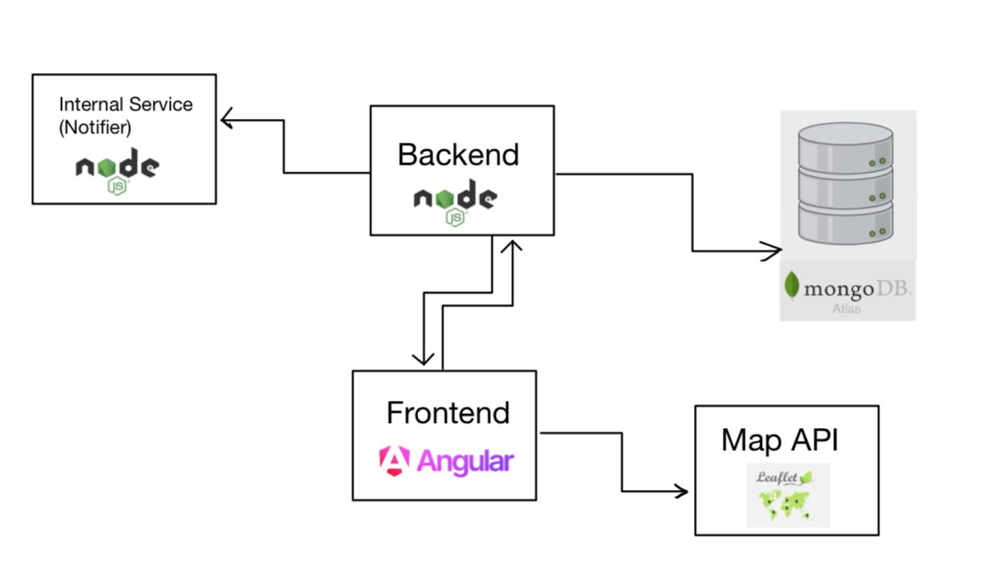

# EventFinder

## Overview

EventFinder is a platform designed to simplify event management and discovery for individuals, clubs, and local businesses. It provides users with the ability to create, search, and join events, as well as connect with friends and groups. The platform also includes a map feature for visualizing event locations.

## General Architecture

The project consists of a Node.js backend that communicates with the frontend, an internal service called "notifier," and MongoDB Atlas for the database. The frontend is built using Angular and communicates with the backend and the Leaflet Map API.

## Features

- **Event Management:** Users can search, create, and join events.
- **Group Management:** Users can search, create, and join groups.
- **Friend Management:** Users can search for and add friends to their network.
- **Email Notifications:** Users receive email notifications for friend requests.
- **Map Integration:** The map displays event locations.

## Problem Statement

With numerous social media platforms available, it can be challenging to keep up with events, club meetings, and friend gatherings. While platforms exist for large-scale events, there is a lack of options for individuals, clubs, and local businesses to promote their events effectively.

## Solution

Our project aims to address this issue by using open street maps to enable users to post and advertise their events or promotions. Users can choose to make their events private and invite-only or public, catering to both individuals and businesses. This platform will allow users to discover events near them, filter events based on their preferences, and find events hosted by friends or specific groups.

## User Workflow

1. **Browsing Events:** Users can browse events happening near them or filter events by specific criteria.
2. **Creating and Joining Events:** Logged-in users can create and join events.
3. **Filtering and Searching:** Users can filter and search for events using different criteria, such as location, date, or type of event.
4. **Adding Friends:** Users can add friends and then create events that are invite-only for those friends.

## Installation

1. Clone the repository.
2. Install dependencies using `npm install`.
3. Set up environment variables (e.g., MongoDB connection string, email service credentials).
4. Run the main backend and the notifier using `npm start`.
5. Run the frontend using `ng serve`.

## Contributors

- Sepehr Ahmadipourshirazi
- Jenna Lee
- Tejeshwar Grewal
- Colwyn William Ralph

